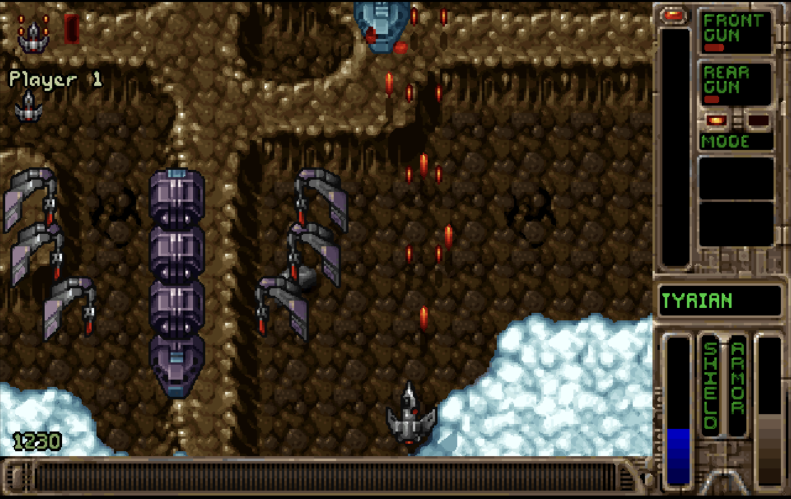
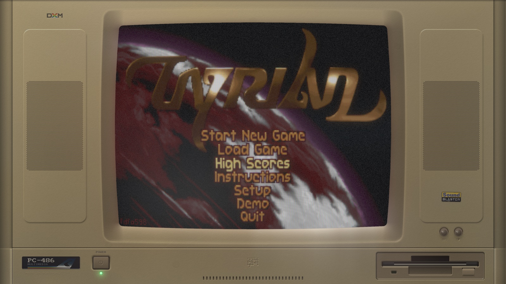

# Tyrian SDL

Tyrian, the 1995 DOS shooter, as a native SDL2 game for macOS, Linux and
Windows — and as a core that runs inside [DOS ex Machina][dxm].  Based on
[OpenTyrian](https://github.com/opentyrian/opentyrian); see
[Credits](#credits-and-licence).

Tyrian is an arcade-style vertical scrolling shooter.  The story is set
in 20,031 where you play as Trent Hawkins, a skilled fighter-pilot employed
to fight MicroSol and save the galaxy.  It features a story mode, one- and
two-player arcade modes, and networked multiplayer.

## Downloads

Self-contained builds are attached to each
[release](https://github.com/pedrocatalao/tyrian-sdl/releases).  They carry
SDL2 and the freeware Tyrian 2.1 game data inside, so there is nothing to
install and nothing to fetch:

| Platform | File | Run |
|---|---|---|
| macOS (Apple Silicon and Intel) | `opentyrian-macos-universal.zip` | Unzip and open `OpenTyrian.app` |
| Linux x86_64 / arm64 | `opentyrian-linux-<arch>.tar.gz` | Extract and run `./opentyrian` |
| Windows x86_64 / arm64 | `opentyrian-windows-<arch>.zip` | Unzip and run `opentyrian.exe` |

The macOS app is not notarized.  If Gatekeeper refuses to open it, right-click
the app, choose *Open*, and confirm once.

Configuration and saved games are kept per user, outside the game directory,
in the same place OpenTyrian uses — existing saves carry over:

| Platform | Location |
|---|---|
| Linux / macOS | `$XDG_CONFIG_HOME/opentyrian`, or `~/.config/opentyrian` |
| Windows | `%APPDATA%\OpenTyrian` |

## Game Data

The game needs the Tyrian 2.1 data files, which have been released as
freeware: <https://camanis.net/tyrian/tyrian21.zip>

The release builds above already contain them.  Otherwise, extract the
archive so that the files (lowercase names) are in one of these places,
searched in order:

1. the directory given with `--data=DIR`
2. a `data` directory next to the executable (inside `Contents/Resources`
   for the macOS app)
3. the system directory the build was configured with
   (`/usr/local/share/games/tyrian` by default; `C:\TYRIAN` on Windows)
4. a `data` directory in the current working directory

`./get_data.sh [dir]` downloads and extracts them for you.  Filenames in the
archive may be uppercase; the script lowercases them, as does
`lower-script.sh` for an existing directory.

## Inside DOS ex Machina

The same source also builds as a core for **[DOS ex Machina][dxm]**, which
runs it inside a simulated 486 with a CRT you can see the scanlines on.

The `.dxm` files on the [releases page][rel] are that build — the game as a
loadable module, one per platform.  They are not standalone programs; DXM
opens them.  Nothing about the game changes: the same code runs in both,
with only the implementation of `src/platform.h` differing.
[doc/dxm.md](doc/dxm.md) describes how.

## Building

Requirements: a C11 compiler, GNU make, pkg-config, SDL2 and, for network
play, SDL2_net.

    make

Network play is left out automatically when SDL2_net is not found
(`make WITH_NETWORK=false` forces that; `WITH_NETWORK=true` requires it).
`make debug` builds with `-Werror`, `-O0` and debug info.  `make install`
honours `DESTDIR` and `prefix`.

A Visual Studio solution is in `visualc/`; it has not been updated for the
files added by the platform split.

The self-contained release builds are produced by the same scripts CI uses:

    ./make_mac.sh      # universal OpenTyrian.app in build/, SDL2.framework bundled
    ./make_linux.sh    # SDL2 built from source and linked statically
    ./get_data.sh      # fetches the game data into data/ (both scripts call it)

The Linux script needs the development headers listed at the top of the file;
SDL loads the matching X11, Wayland and audio backends at run time, so the
resulting binary depends on nothing but glibc.  The Windows packages are
built under MSYS2 by `.github/workflows/windows.yml`.

The DXM core is a separate CMake build:

    cmake -S . -B build-core -DOT_CORE=ON -DOT_MODULE=ON
    cmake --build build-core

## Command-Line Options

    -h, --help                   Show help about options
    -s, --no-sound               Disable audio
    -j, --no-joystick            Disable joystick/gamepad input
    -x, --no-xmas                Disable Christmas mode
    -t, --data=DIR               Set Tyrian data directory
    -n, --net=HOST[:PORT]        Start a networked game
    --net-player-name=NAME       Set local player name in a networked game
    --net-player-number=NUMBER   Set local player number in a networked game
                                 (1 or 2)
    -p, --net-port=PORT          Set local port to bind (default is 1333)
    -d, --net-delay=FRAMES       Set lag-compensation delay (default is 1)

## Keyboard Controls

    alt-enter      -- toggle full-screen

    arrow keys     -- ship movement
    space          -- fire weapons
    enter          -- toggle rear weapon mode
    ctrl/alt       -- fire left/right sidekick

## Network Multiplayer

There is no arena; networked games are started manually from the command
line, simultaneously by both players:

    opentyrian --net HOSTNAME --net-player-name NAME --net-player-number NUMBER

where HOSTNAME is the IP address of your opponent, NUMBER is either 1 or 2
depending on which ship you intend to pilot, and NAME is your alias.

UDP port 1333 is used, but in most cases players do not need to open any
ports, because the game makes use of UDP hole punching.

Network play is absent from the macOS build, which has no SDL2_net framework
bundled, and from the DXM core.

## Credits and Licence

Tyrian was created by Eclipse Productions and published by Epic MegaGames in
1995.  The Tyrian 2.1 data files were later released as freeware; this
repository never redistributes them outside the release packages, which fetch
them from the link above.

This is a derivative of **OpenTyrian**, the cross-platform port by the
OpenTyrian Development Team, which is where the engine and nearly all of this
code come from.  It is not affiliated with or endorsed by them.  What this
repository adds is the platform seam that lets the game build with no SDL at
all, the DOS ex Machina core, and self-contained release builds for the three
platforms.

Licensed under the GNU General Public License, version 2 or later — the same
terms as OpenTyrian.  See [COPYING](COPYING).

## Links

- this port: <https://github.com/pedrocatalao/tyrian-sdl>
- OpenTyrian: <https://github.com/opentyrian/opentyrian>
- DOS ex Machina: <https://github.com/pedrocatalao/dos-ex-machina>
- forums:  <https://tyrian2k.proboards.com/board/5>
- irc:     <ircs://irc.oftc.net/#opentyrian>

[dxm]: https://github.com/pedrocatalao/dos-ex-machina
[rel]: https://github.com/pedrocatalao/tyrian-sdl/releases
